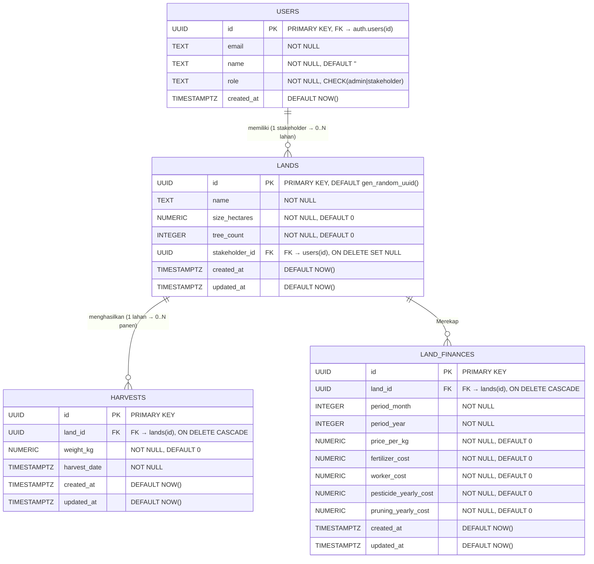

# ERD, Kamus Data & Struktur Tabel — Sistem Manajemen Panen Sawit

---

## 1. Entity Relationship Diagram (ERD) — Notasi James Martin (Crow's Foot)

Notasi **James Martin** menggunakan simbol **crow's foot** (kaki gagak) untuk merepresentasikan kardinalitas relasi antar entitas. Berikut penjelasan simbol:

| Simbol | Arti |
|--------|------|
| `\|\|` | **Exactly One** (satu dan hanya satu) |
| `o\|` | **Zero or One** (nol atau satu) |
| `\|{` | **One or Many** (satu atau banyak) |
| `o{` | **Zero or Many** (nol atau banyak) |



### Penjelasan Relasi

| No | Relasi | Kardinalitas | Keterangan |
|----|--------|--------------|------------|
| 1 | **USERS → LANDS** | One-to-Many (`1 : 0..*`) | Satu user (stakeholder) dapat memiliki **nol atau banyak** lahan. Satu lahan hanya dimiliki oleh **nol atau satu** stakeholder. |
| 2 | **LANDS → HARVESTS** | One-to-Many (`1 : 0..*`) | Satu lahan dapat memiliki **nol atau banyak** data panen. Satu data panen **harus** terhubung ke tepat **satu** lahan. |
| 3 | **LANDS → LAND_FINANCES** | One-to-Many (`1 : 0..*`) | Satu lahan dapat memiliki **nol atau banyak** rekapan keuangan. |

### Aturan Referential Integrity

| FK Constraint | Parent | Child | ON DELETE |
|---------------|--------|-------|-----------|
| `users(id) ← lands(stakeholder_id)` | `users` | `lands` | `SET NULL` — Jika user dihapus, lahan tetap ada tapi `stakeholder_id` menjadi NULL |
| `lands(id) ← harvests(land_id)` | `lands` | `harvests` | `CASCADE` — Jika lahan dihapus, semua data panen terkait ikut terhapus |
| `lands(id) ← land_finances(land_id)` | `lands` | `land_finances` | `CASCADE` — Jika lahan dihapus, semua data keuangan terkait ikut terhapus |
| `auth.users(id) ← users(id)` | `auth.users` | `users` | `CASCADE` — Jika akun auth dihapus, profil user ikut terhapus |

---

## 2. Kamus Data (Data Dictionary)

### 2.1 Tabel: `users`

> **Deskripsi:** Menyimpan data profil pengguna sistem. Terhubung dengan tabel `auth.users` milik Supabase Authentication. Setiap record dibuat otomatis melalui trigger saat user melakukan registrasi.

| No | Nama Kolom | Tipe Data | Panjang / Presisi | Nullable | Default | Constraint | Deskripsi |
|----|------------|-----------|-------------------|----------|---------|------------|-----------|
| 1 | `id` | `UUID` | 36 karakter | **NOT NULL** | — | `PRIMARY KEY`, `REFERENCES auth.users(id) ON DELETE CASCADE` | Identifier unik user, sama dengan ID di Supabase Auth |
| 2 | `email` | `TEXT` | Variable | **NOT NULL** | — | — | Alamat email pengguna yang digunakan untuk login |
| 3 | `name` | `TEXT` | Variable | **NOT NULL** | `''` (string kosong) | — | Nama lengkap pengguna |
| 4 | `role` | `TEXT` | Variable | **NOT NULL** | — | `CHECK (role IN ('admin', 'stakeholder'))` | Peran pengguna: `admin` (pengelola) atau `stakeholder` (pemilik lahan) |
| 5 | `created_at` | `TIMESTAMP WITH TIME ZONE` | — | NULL allowed | `NOW()` | — | Waktu pembuatan record |

---

### 2.2 Tabel: `lands`

> **Deskripsi:** Menyimpan data lahan perkebunan sawit. Setiap lahan dapat dimiliki oleh satu stakeholder. Admin memiliki hak kelola penuh (CRUD) terhadap semua lahan.

| No | Nama Kolom | Tipe Data | Panjang / Presisi | Nullable | Default | Constraint | Deskripsi |
|----|------------|-----------|-------------------|----------|---------|------------|-----------|
| 1 | `id` | `UUID` | 36 karakter | **NOT NULL** | `gen_random_uuid()` | `PRIMARY KEY` | Identifier unik lahan, auto-generated |
| 2 | `name` | `TEXT` | Variable | **NOT NULL** | — | — | Nama/label lahan (contoh: "Blok A1", "Kebun Utara") |
| 3 | `size_hectares` | `NUMERIC` | Variable precision | **NOT NULL** | `0` | — | Luas lahan dalam satuan hektar (Ha) |
| 4 | `tree_count` | `INTEGER` | — | **NOT NULL** | `0` | — | Jumlah batang sawit pada lahan tersebut |
| 5 | `stakeholder_id` | `UUID` | 36 karakter | NULL allowed | — | `REFERENCES users(id) ON DELETE SET NULL` | ID stakeholder pemilik lahan. NULL jika belum ditetapkan |
| 6 | `created_at` | `TIMESTAMP WITH TIME ZONE` | — | NULL allowed | `NOW()` | — | Waktu pembuatan record lahan |

---

### 2.3 Tabel: `harvests`

> **Deskripsi:** Menyimpan data pemanenan buah sawit. Mendukung proses offline-first — data disimpan di local storage terlebih dahulu kemudian disinkronkan ke server. Kolom `updated_at` diperbarui otomatis oleh trigger.

| No | Nama Kolom | Tipe Data | Panjang / Presisi | Nullable | Default | Constraint | Deskripsi |
|----|------------|-----------|-------------------|----------|---------|------------|-----------|
| 1 | `id` | `UUID` | 36 karakter | **NOT NULL** | — | `PRIMARY KEY` | Identifier unik data panen, di-generate oleh aplikasi client |
| 2 | `land_id` | `UUID` | 36 karakter | NULL allowed | — | `REFERENCES lands(id) ON DELETE CASCADE` | ID lahan tempat panen dilakukan |
| 3 | `weight_kg` | `NUMERIC` | Variable precision | **NOT NULL** | `0` | — | Berat hasil panen dalam satuan kilogram (Kg) |
| 4 | `harvest_date` | `TIMESTAMP WITH TIME ZONE` | — | **NOT NULL** | — | — | Tanggal dan waktu pelaksanaan panen |
| 5 | `created_at` | `TIMESTAMP WITH TIME ZONE` | — | NULL allowed | `NOW()` | — | Waktu pembuatan record di server |
| 6 | `updated_at` | `TIMESTAMP WITH TIME ZONE` | — | NULL allowed | `NOW()` | Auto-update via `TRIGGER set_updated_at` | Waktu terakhir record diperbarui |

---

### 2.4 Tabel: `land_finances`

> **Deskripsi:** Mencatat rekapan operasional dan pemasukan bulanan tiap lahan.

| Nama Kolom | Tipe Data | Wajib (NOT NULL) | Kunci | Default | Deskripsi |
| :--- | :--- | :---: | :---: | :--- | :--- |
| `id` | `UUID` | ✔ | PK | `gen_random_uuid()` | Primary key, ID rekam biaya unik |
| `land_id` | `UUID` | ✔ | FK | - | Referensi Lahan (Cascade Delete) |
| `period_month` | `INTEGER` | ✔ | - | - | Bulan rekaman (1-12) |
| `period_year` | `INTEGER` | ✔ | - | - | Tahun rekaman (cth: 2026) |
| `price_per_kg` | `NUMERIC` | ✔ | 0 | 0 | Harga per kg sawit saat bulan tersebut |
| `fertilizer_cost` | `NUMERIC` | ✔ | 0 | 0 | Biaya pupuk bulan tersebut |
| `worker_cost` | `NUMERIC` | ✔ | 0 | 0 | Biaya pekerja bulan tersebut |
| `pesticide_yearly_cost` | `NUMERIC` | ✔ | 0 | 0 | Biaya pestisida selama setahun |
| `pruning_yearly_cost` | `NUMERIC` | ✔ | 0 | 0 | Biaya pruning selama setahun |
| `created_at` | `TIMESTAMP WITH TIME ZONE` | ✔ | - | `NOW()` | Waktu pencatatan |
| `updated_at` | `TIMESTAMP WITH TIME ZONE` | ✔ | - | `NOW()` | Waktu modifikasi terakhir |

*(Terdapat UNIQUE constraint pada kombinasi: land_id, period_month, dan period_year)*

---

## 3. Struktur Tabel (DDL — Data Definition Language)

### 3.1 Tabel `users`

```sql
CREATE TABLE IF NOT EXISTS users (
    id          UUID REFERENCES auth.users(id) ON DELETE CASCADE PRIMARY KEY,
    email       TEXT NOT NULL,
    name        TEXT NOT NULL DEFAULT '',
    role        TEXT CHECK (role IN ('admin', 'stakeholder')) NOT NULL,
    created_at  TIMESTAMP WITH TIME ZONE DEFAULT NOW()
);
```

### 3.2 Tabel `lands`

```sql
CREATE TABLE IF NOT EXISTS lands (
    id              UUID DEFAULT gen_random_uuid() PRIMARY KEY,
    name            TEXT NOT NULL,
    size_hectares   NUMERIC NOT NULL DEFAULT 0,
    tree_count      INTEGER NOT NULL DEFAULT 0,
    stakeholder_id  UUID REFERENCES users(id) ON DELETE SET NULL,
    created_at      TIMESTAMP WITH TIME ZONE DEFAULT NOW()
);
```

### 3.3 Tabel `harvests`

```sql
CREATE TABLE IF NOT EXISTS harvests (
    id            UUID PRIMARY KEY,
    land_id       UUID REFERENCES lands(id) ON DELETE CASCADE,
    weight_kg     NUMERIC NOT NULL DEFAULT 0,
    harvest_date  TIMESTAMP WITH TIME ZONE NOT NULL,
    created_at    TIMESTAMP WITH TIME ZONE DEFAULT NOW(),
    updated_at    TIMESTAMP WITH TIME ZONE DEFAULT NOW()
);
```

---

## 4. Trigger & Function

### 4.1 Auto-update `updated_at` pada tabel `harvests`

```sql
CREATE OR REPLACE FUNCTION update_updated_at_column()
RETURNS TRIGGER AS $$
BEGIN
    NEW.updated_at = NOW();
    RETURN NEW;
END;
$$ LANGUAGE plpgsql;

CREATE TRIGGER set_updated_at
    BEFORE UPDATE ON harvests
    FOR EACH ROW
    EXECUTE FUNCTION update_updated_at_column();
```

> **Keterangan:** Setiap kali record di tabel `harvests` di-update, kolom `updated_at` otomatis diisi dengan timestamp saat ini.

### 4.2 Auto-insert user profile saat registrasi

```sql
CREATE OR REPLACE FUNCTION public.handle_new_user()
RETURNS TRIGGER AS $$
BEGIN
    INSERT INTO public.users (id, email, name, role)
    VALUES (
        NEW.id,
        NEW.email,
        COALESCE(NEW.raw_user_meta_data->>'name', ''),
        COALESCE(NEW.raw_user_meta_data->>'role', 'stakeholder')
    );
    RETURN NEW;
END;
$$ LANGUAGE plpgsql SECURITY DEFINER;

CREATE TRIGGER on_auth_user_created
    AFTER INSERT ON auth.users
    FOR EACH ROW
    EXECUTE FUNCTION public.handle_new_user();
```

> **Keterangan:** Saat user baru mendaftar melalui Supabase Auth, trigger ini otomatis membuat record profil di tabel `users` dengan data dari metadata registrasi. Default role adalah `stakeholder`.

---

## 5. Row Level Security (RLS) Policies

### 5.1 Tabel `users`

| Policy Name | Operation | Target | Rule | Deskripsi |
|-------------|-----------|--------|------|-----------|
| `users_select` | `SELECT` | `authenticated` | `USING (true)` | Semua user yang login bisa membaca semua data user |
| `users_update_own` | `UPDATE` | `authenticated` | `USING (auth.uid() = id)` | User hanya bisa mengubah data miliknya sendiri |
| `users_insert` | `INSERT` | `authenticated` | `WITH CHECK (true)` | Semua user yang login bisa insert (dipakai saat registrasi) |

### 5.2 Tabel `lands`

| Policy Name | Operation | Target | Rule | Deskripsi |
|-------------|-----------|--------|------|-----------|
| `lands_admin_all` | `ALL` | `authenticated` | `USING (role = 'admin')` | Admin memiliki akses penuh ke semua lahan |
| `lands_stakeholder_select` | `SELECT` | `authenticated` | `USING (stakeholder_id = auth.uid())` | Stakeholder hanya bisa melihat lahan miliknya |

### 5.3 Tabel `harvests`

| Policy Name | Operation | Target | Rule | Deskripsi |
|-------------|-----------|--------|------|-----------|
| `harvests_admin_all` | `ALL` | `authenticated` | `USING (role = 'admin')` | Admin memiliki akses penuh ke semua data panen |
| `harvests_stakeholder_select` | `SELECT` | `authenticated` | `USING (land_id IN stakeholder's lands)` | Stakeholder hanya bisa melihat data panen dari lahan miliknya |

---

## 6. Ringkasan Entitas & Statistik

| Entitas | Jumlah Kolom | Primary Key | Foreign Keys | Triggers | RLS Policies |
|---------|--------------|-------------|--------------|----------|--------------|
| `users` | 5 | `id` (UUID) | 1 (`→ auth.users`) | 1 (`on_auth_user_created`) | 3 |
| `lands` | 6 | `id` (UUID) | 1 (`→ users`) | — | 2 |
| `harvests` | 6 | `id` (UUID) | 1 (`→ lands`) | 1 (`set_updated_at`) | 2 |
| **Total** | **17** | **3** | **3** | **2** | **7** |
