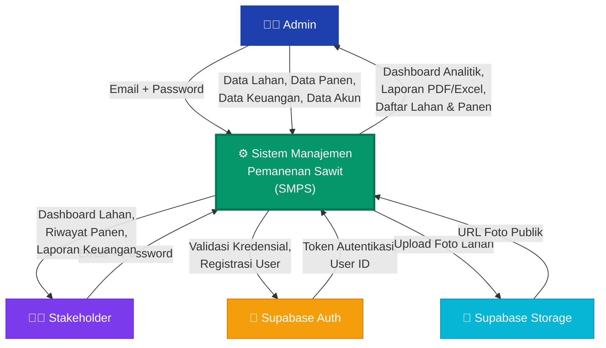
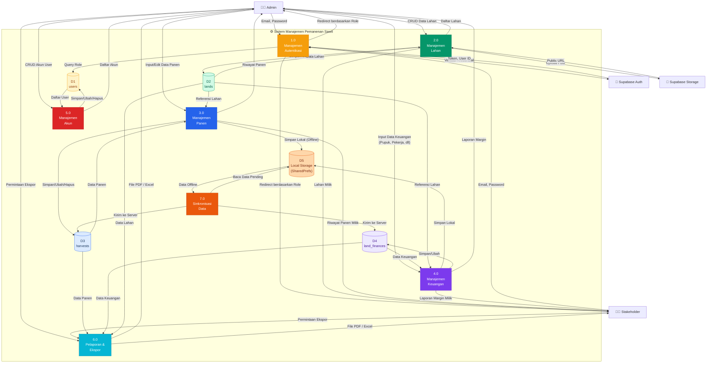
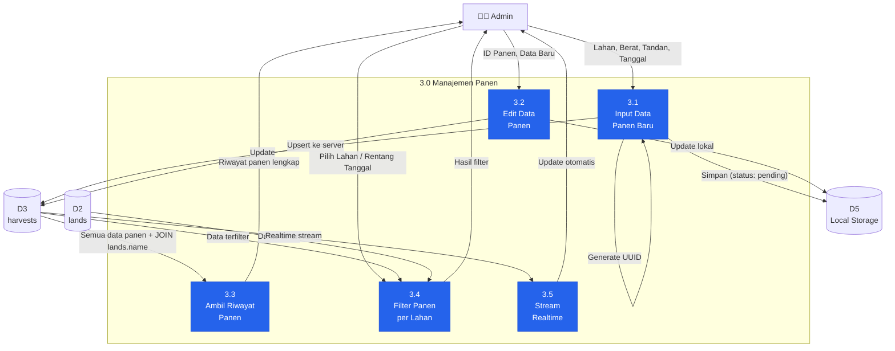
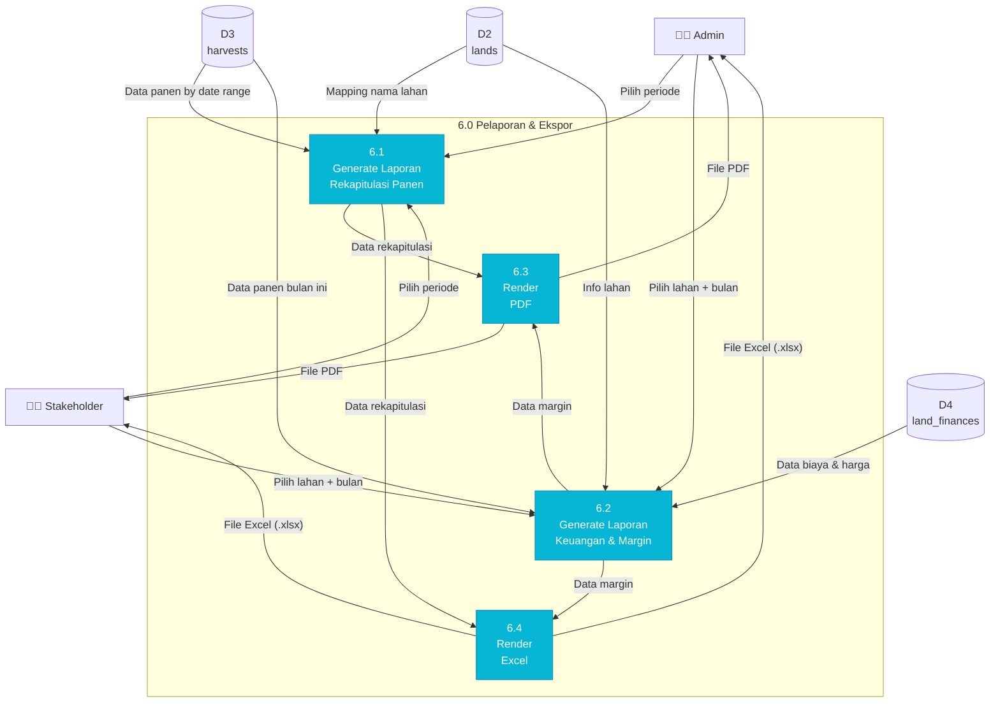
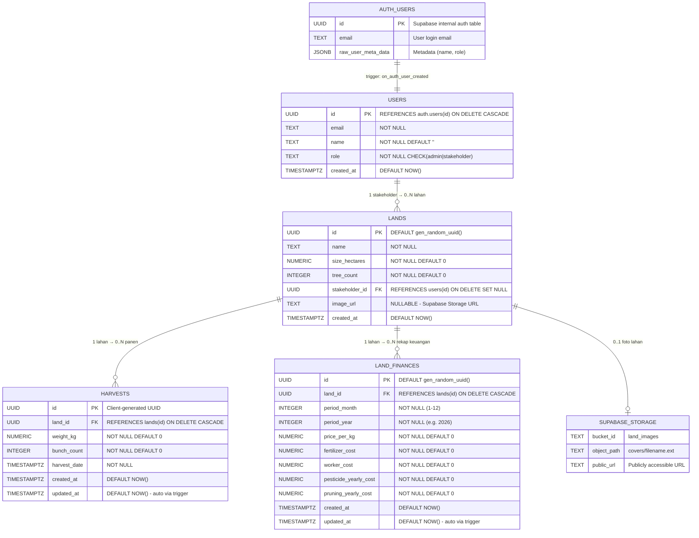
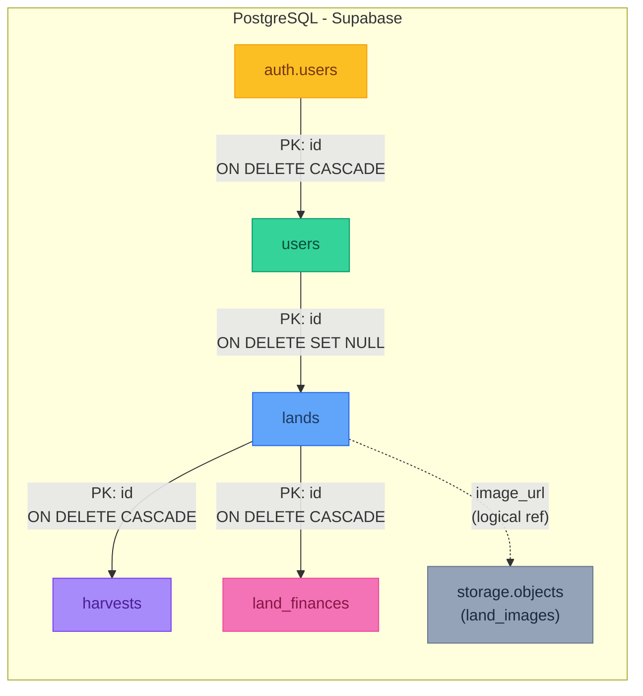

# Logical DFD & Physical ERD — Sistem Manajemen Panen Sawit

---

## 1. Data Flow Diagram (DFD) — Logical

### 1.1 Diagram Konteks (Level 0)

Diagram konteks menunjukkan sistem sebagai satu proses utama yang berinteraksi dengan entitas luar (external entities).

#### Penjelasan External Entity

| No | External Entity | Deskripsi |
|----|----------------|-----------|
| 1 | **Admin** | Pengelola sistem yang memiliki akses penuh: CRUD lahan, panen, keuangan, akun user |
| 2 | **Stakeholder** | Pemilik lahan yang hanya bisa melihat data lahan, panen, dan keuangan miliknya |
| 3 | **Supabase Auth** | Layanan autentikasi pihak ketiga (Supabase) untuk login/registrasi |
| 4 | **Supabase Storage** | Penyimpanan file cloud untuk foto/gambar lahan |

---

### 1.2 DFD Level 1

Dekomposisi sistem utama menjadi proses-proses inti.

#### Penjelasan Proses DFD Level 1

| No | ID Proses | Nama Proses | Deskripsi |
|----|-----------|-------------|-----------|
| 1 | **1.0** | Manajemen Autentikasi | Login menggunakan Supabase Auth, validasi kredensial, cek role (`admin`/`stakeholder`), dan redirect ke dashboard yang sesuai |
| 2 | **2.0** | Manajemen Lahan | CRUD data lahan oleh Admin. Stakeholder hanya bisa melihat lahan miliknya. Termasuk upload foto lahan ke Supabase Storage |
| 3 | **3.0** | Manajemen Panen | Input/edit data panen (berat kg, jumlah tandan, tanggal panen) oleh Admin. Data disimpan ke local storage (offline-first) dan disinkronkan ke server |
| 4 | **4.0** | Manajemen Keuangan | Input data keuangan per lahan per bulan (biaya pupuk, pekerja, pestisida, pruning, harga/kg). Menghitung margin laba bersih |
| 5 | **5.0** | Manajemen Akun | Admin mengelola (CRUD) akun user seluruh sistem |
| 6 | **6.0** | Pelaporan & Ekspor | Generate laporan rekapitulasi panen dan laporan keuangan/margin dalam format PDF dan Excel |
| 7 | **7.0** | Sinkronisasi Data | Proses background yang membaca data pending dari local storage dan mengirimnya ke Supabase server |

#### Penjelasan Data Store

| No | ID | Nama Data Store | Tipe | Deskripsi |
|----|----|-----------------|------|-----------|
| 1 | **D1** | `users` | Supabase (Cloud) | Profil pengguna: id, email, nama, role |
| 2 | **D2** | `lands` | Supabase (Cloud) | Data lahan: nama, luas, jumlah pohon, foto, stakeholder |
| 3 | **D3** | `harvests` | Supabase (Cloud) | Data panen: berat, tandan, tanggal panen |
| 4 | **D4** | `land_finances` | Supabase (Cloud) | Data keuangan lahan: biaya bulanan, harga, margin |
| 5 | **D5** | Local Storage | SharedPreferences (Lokal) | Cache offline: harvests pending, finances pending, lands cache |

---

### 1.3 DFD Level 2 — Proses 3.0 (Manajemen Panen)

Dekomposisi lebih detail pada proses input & sinkronisasi panen.

---

### 1.4 DFD Level 2 — Proses 6.0 (Pelaporan & Ekspor)

---

## 2. Physical ERD — Notasi James Martin (Crow's Foot)

Physical ERD menunjukkan implementasi **fisik** database, termasuk: tipe data spesifik platform (PostgreSQL), constraint, trigger, index, dan unique constraint.

### 2.1 Diagram Physical ERD

---

### 2.2 Spesifikasi Fisik Detail per Tabel

#### Tabel: `users`

| Kolom | Tipe Data PostgreSQL | Constraint | Keterangan Fisik |
|-------|---------------------|------------|------------------|
| `id` | `UUID` | `PK`, `FK → auth.users(id) ON DELETE CASCADE` | Tidak auto-generated, diisi dari Supabase Auth trigger |
| `email` | `TEXT` | `NOT NULL` | Variable-length, unlimited |
| `name` | `TEXT` | `NOT NULL DEFAULT ''` | String kosong jika tidak diisi saat registrasi |
| `role` | `TEXT` | `NOT NULL`, `CHECK (role IN ('admin', 'stakeholder'))` | Enum logical via CHECK constraint |
| `created_at` | `TIMESTAMP WITH TIME ZONE` | `DEFAULT NOW()` | Timezone-aware, auto-fill |

**RLS:** Enabled  
**Trigger:** `on_auth_user_created` → auto-insert saat registrasi via `handle_new_user()`

---

#### Tabel: `lands`

| Kolom | Tipe Data PostgreSQL | Constraint | Keterangan Fisik |
|-------|---------------------|------------|------------------|
| `id` | `UUID` | `PK`, `DEFAULT gen_random_uuid()` | Auto-generated UUID v4 oleh PostgreSQL |
| `name` | `TEXT` | `NOT NULL` | Nama/label lahan |
| `size_hectares` | `NUMERIC` | `NOT NULL DEFAULT 0` | Presisi arbitrer, cocok untuk desimal luas |
| `tree_count` | `INTEGER` | `NOT NULL DEFAULT 0` | Jumlah pohon sawit di lahan |
| `stakeholder_id` | `UUID` | `FK → users(id) ON DELETE SET NULL`, `NULLABLE` | NULL = belum ditugaskan |
| `image_url` | `TEXT` | `NULLABLE` | URL publik foto dari Supabase Storage bucket `land_images` |
| `created_at` | `TIMESTAMP WITH TIME ZONE` | `DEFAULT NOW()` | Auto-fill saat insert |

**RLS:** Enabled  
**Index:** Implicit on `id` (PK)

---

#### Tabel: `harvests`

| Kolom | Tipe Data PostgreSQL | Constraint | Keterangan Fisik |
|-------|---------------------|------------|------------------|
| `id` | `UUID` | `PK` | Di-generate oleh client (Flutter app) menggunakan `uuid` package |
| `land_id` | `UUID` | `FK → lands(id) ON DELETE CASCADE` | Cascade delete: hapus lahan → hapus semua panen |
| `weight_kg` | `NUMERIC` | `NOT NULL DEFAULT 0` | Berat total panen (kilogram) |
| `bunch_count` | `INTEGER` | `NOT NULL DEFAULT 0` | Jumlah tandan buah segar (TBS) |
| `harvest_date` | `TIMESTAMP WITH TIME ZONE` | `NOT NULL` | Tanggal pelaksanaan panen |
| `created_at` | `TIMESTAMP WITH TIME ZONE` | `DEFAULT NOW()` | Waktu record pertama kali dibuat |
| `updated_at` | `TIMESTAMP WITH TIME ZONE` | `DEFAULT NOW()` | Auto-update via trigger `set_updated_at` |

**RLS:** Enabled  
**Trigger:** `set_updated_at` → `BEFORE UPDATE` → `update_updated_at_column()`  
**Computed (App-level):** `avg_weight_per_bunch = weight_kg / bunch_count`

---

#### Tabel: `land_finances`

| Kolom | Tipe Data PostgreSQL | Constraint | Keterangan Fisik |
|-------|---------------------|------------|------------------|
| `id` | `UUID` | `PK`, `DEFAULT gen_random_uuid()` | Auto-generated |
| `land_id` | `UUID` | `FK → lands(id) ON DELETE CASCADE` | Cascade delete |
| `period_month` | `INTEGER` | `NOT NULL` | Bulan periode (1–12) |
| `period_year` | `INTEGER` | `NOT NULL` | Tahun periode (e.g., 2026) |
| `price_per_kg` | `NUMERIC` | `NOT NULL DEFAULT 0` | Harga jual sawit per kilogram (Rp) |
| `fertilizer_cost` | `NUMERIC` | `NOT NULL DEFAULT 0` | Biaya pupuk bulanan (Rp) |
| `worker_cost` | `NUMERIC` | `NOT NULL DEFAULT 0` | Biaya pekerja bulanan (Rp) |
| `pesticide_yearly_cost` | `NUMERIC` | `NOT NULL DEFAULT 0` | Biaya pestisida tahunan (Rp), dibagi 12 di app |
| `pruning_yearly_cost` | `NUMERIC` | `NOT NULL DEFAULT 0` | Biaya pruning/pangkas tahunan (Rp), dibagi 12 di app |
| `created_at` | `TIMESTAMP WITH TIME ZONE` | `DEFAULT NOW()` | Auto-fill |
| `updated_at` | `TIMESTAMP WITH TIME ZONE` | `DEFAULT NOW()` | Auto-update via trigger |

**RLS:** Enabled  
**Trigger:** `set_finances_updated_at` → `BEFORE UPDATE` → `update_updated_at_column()`  
**Unique Constraint:** `UNIQUE(land_id, period_month, period_year)` — satu record keuangan per lahan per bulan

---

#### Storage: `land_images` (Supabase Storage Bucket)

| Properti | Nilai |
|----------|-------|
| **Bucket ID** | `land_images` |
| **Akses** | Public (gambar bisa diakses tanpa auth) |
| **Path Pattern** | `covers/{landId}_{timestamp}.{ext}` |
| **RLS Policies** | SELECT: Public, INSERT/UPDATE/DELETE: Admin only |

---

### 2.3 Peta Referential Integrity Lengkap

### 2.4 Tabel Ringkasan Relasi Fisik

| No | Parent Table | Child Table | FK Column | Cardinality | ON DELETE | UNIQUE Constraint |
|----|-------------|-------------|-----------|-------------|-----------|-------------------|
| 1 | `auth.users` | `users` | `users.id` | 1:1 | `CASCADE` | PK |
| 2 | `users` | `lands` | `lands.stakeholder_id` | 1:N (0..*) | `SET NULL` | — |
| 3 | `lands` | `harvests` | `harvests.land_id` | 1:N (0..*) | `CASCADE` | — |
| 4 | `lands` | `land_finances` | `land_finances.land_id` | 1:N (0..*) | `CASCADE` | `UNIQUE(land_id, period_month, period_year)` |

---

### 2.5 Daftar Trigger & Function

| No | Trigger Name | Table | Event | Timing | Function | Deskripsi |
|----|-------------|-------|-------|--------|----------|-----------|
| 1 | `on_auth_user_created` | `auth.users` | `INSERT` | `AFTER` | `handle_new_user()` | Auto-insert profil di `users` saat signup |
| 2 | `set_updated_at` | `harvests` | `UPDATE` | `BEFORE` | `update_updated_at_column()` | Auto-update `updated_at` timestamp |
| 3 | `set_finances_updated_at` | `land_finances` | `UPDATE` | `BEFORE` | `update_updated_at_column()` | Auto-update `updated_at` timestamp |

---

### 2.6 Ringkasan RLS Policies per Tabel

| Tabel | Total Policies | Admin Access | Stakeholder Access |
|-------|---------------|-------------|-------------------|
| `users` | 3 | SELECT all, INSERT, UPDATE own | SELECT all, UPDATE own |
| `lands` | 2 | ALL (CRUD) | SELECT own only |
| `harvests` | 2 | ALL (CRUD) | SELECT own lands only |
| `land_finances` | 2 | ALL (CRUD) | SELECT own lands only |
| `storage.objects` | 4 | SELECT, INSERT, UPDATE, DELETE | SELECT only (public) |
| **Total** | **13** | | |

---

## 3. Mapping Logical → Physical

| DFD Data Store | Physical Table | DBMS | Storage Engine |
|----------------|---------------|------|----------------|
| D1: users | `public.users` | PostgreSQL (Supabase) | Cloud |
| D2: lands | `public.lands` | PostgreSQL (Supabase) | Cloud |
| D3: harvests | `public.harvests` | PostgreSQL (Supabase) | Cloud |
| D4: land_finances | `public.land_finances` | PostgreSQL (Supabase) | Cloud |
| D5: Local Storage | `SharedPreferences` | Key-Value (JSON) | Device Local |
| — | `auth.users` | PostgreSQL (Supabase) | Cloud (Managed) |
| — | `storage.objects` | Supabase Storage | Cloud (S3-compatible) |
