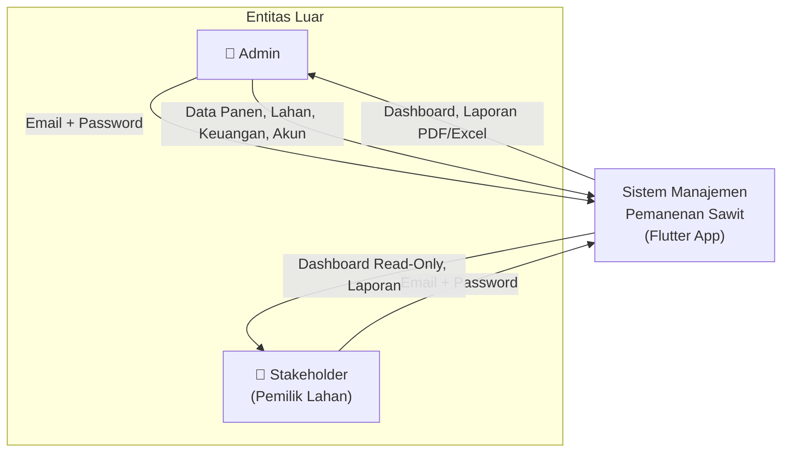
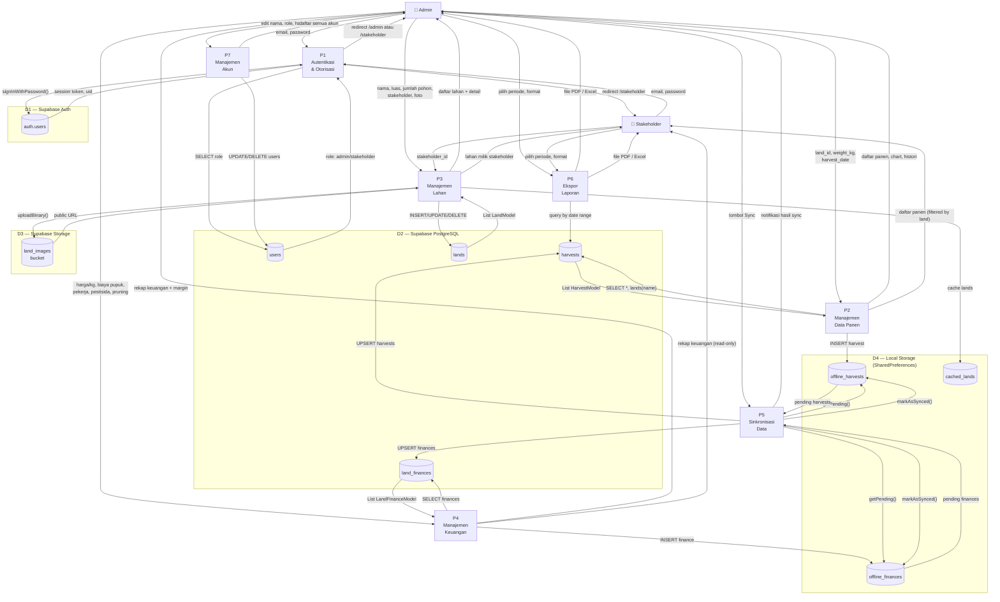
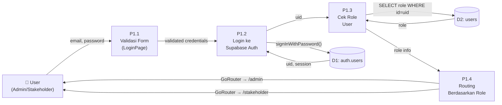
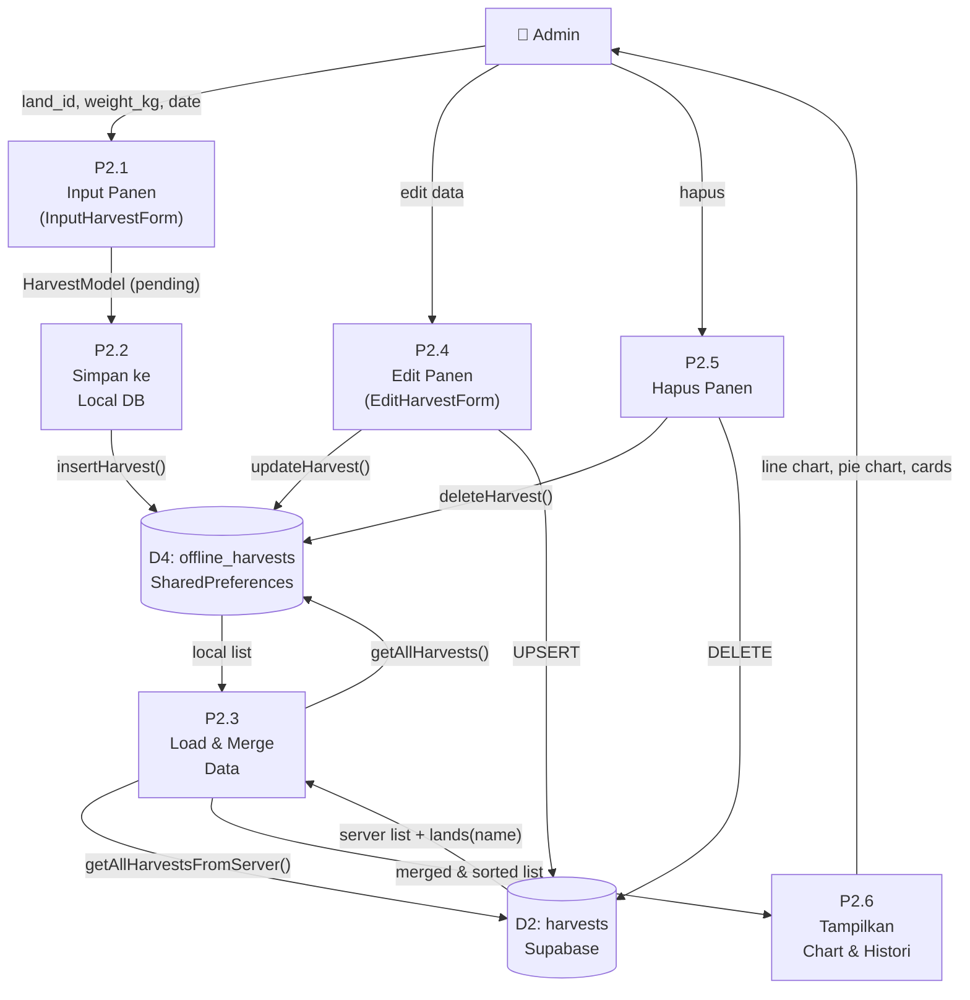
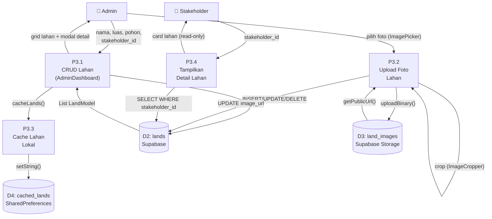
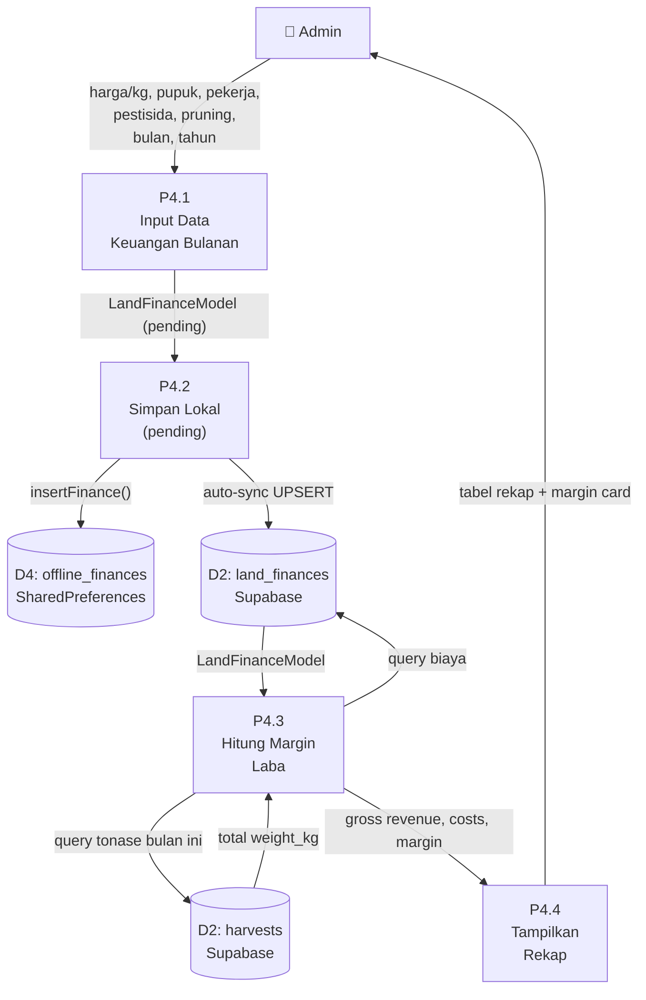
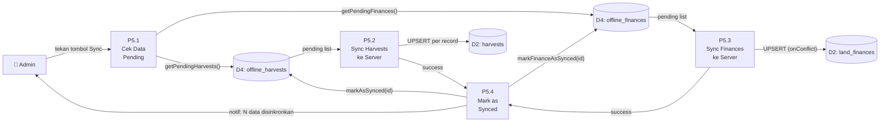
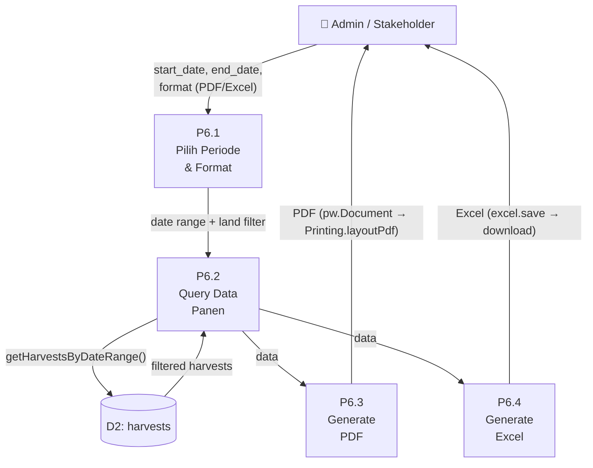
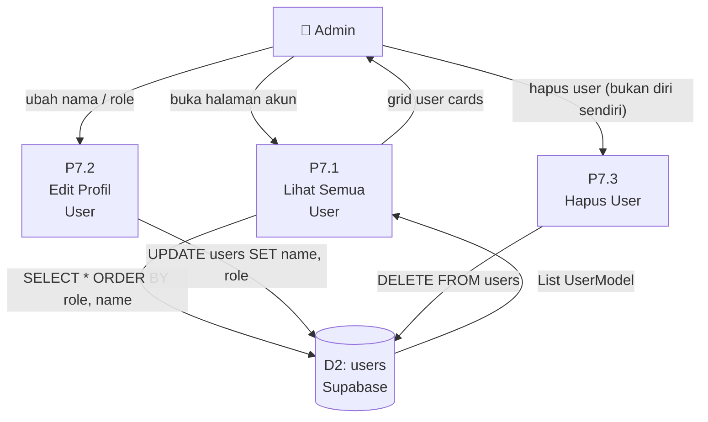
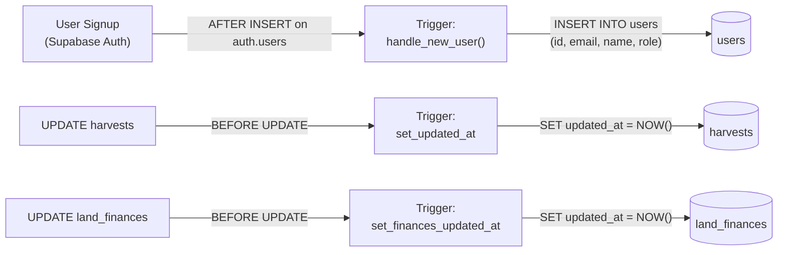

# Physical DFD — Sistem Manajemen Panen Sawit

## Ringkasan Sistem

Aplikasi Flutter multi-platform (Web, Android, Desktop) untuk mengelola data panen kelapa sawit. Menggunakan arsitektur **offline-first** dengan local storage (SharedPreferences) dan sinkronisasi ke **Supabase** (PostgreSQL + Auth + Storage).

---

## Diagram Konteks (Level 0)



> **Penjelasan:** Sistem memiliki 2 aktor utama. **Admin** memiliki hak CRUD penuh atas seluruh data. **Stakeholder** hanya bisa melihat data lahan miliknya sendiri.

---

## DFD Level 1 — Proses Utama



---

## DFD Level 2 — Detail Per Proses

### P1 — Autentikasi & Otorisasi



| Komponen Fisik | Teknologi | File |
|---|---|---|
| Form Login | Flutter `TextFormField` | `login_page.dart` |
| Auth Provider | Supabase Auth SDK | `supabase_flutter` |
| Router | GoRouter | `app_router.dart` |
| Policy | Row Level Security (RLS) | `supabase_schema.sql` |

---

### P2 — Manajemen Data Panen



| Komponen Fisik | Teknologi | File |
|---|---|---|
| Form Input | Flutter Form | `input_harvest_form.dart` |
| Form Edit | Flutter Form | `edit_harvest_form.dart` |
| Repository | Supabase Client | `harvest_repository.dart` |
| Local DB | SharedPreferences | `local_db.dart` |
| Chart | fl_chart (LineChart, PieChart) | `admin_dashboard.dart` |

---

### P3 — Manajemen Lahan



| Komponen Fisik | Teknologi | File |
|---|---|---|
| CRUD Lahan | Supabase Client | `land_repository.dart` |
| Image Picker | `image_picker` plugin | `admin_dashboard.dart` |
| Image Cropper | `image_cropper` plugin | `admin_dashboard.dart` |
| Storage | Supabase Storage (bucket: `land_images`) | `land_repository.dart` |

---

### P4 — Manajemen Keuangan (Rekapitulasi)



**Rumus Perhitungan Margin:**
```
Pendapatan Kotor = Total Tonase × Harga/Kg
Pengeluaran = Pupuk + Pekerja + (Pestisida/12) + (Pruning/12)
Margin Laba = Pendapatan Kotor − Pengeluaran
```

---

### P5 — Sinkronisasi Data (Offline-First)



---

### P6 — Ekspor Laporan



| Jenis Laporan | Library | Output |
|---|---|---|
| Rekap Panen (PDF) | `pdf` + `printing` | Tabel panen + total berat |
| Rekap Panen (Excel) | `excel` | Spreadsheet .xlsx |
| Laporan Keuangan (PDF) | `pdf` + `printing` | Ringkasan margin + rincian panen |
| Laporan Keuangan (Excel) | `excel` | Spreadsheet .xlsx |

---

### P7 — Manajemen Akun (Admin Only)



---

## Ringkasan Data Store

| ID | Nama Store | Tipe Fisik | Lokasi | Isi |
|---|---|---|---|---|
| D1 | `auth.users` | PostgreSQL (Supabase Auth) | Cloud | Credential autentikasi |
| D2a | `users` | PostgreSQL | Cloud | Profil user (id, email, name, role) |
| D2b | `lands` | PostgreSQL | Cloud | Data lahan (nama, luas, pohon, stakeholder, image_url) |
| D2c | `harvests` | PostgreSQL | Cloud | Data panen (land_id, weight_kg, harvest_date) |
| D2d | `land_finances` | PostgreSQL | Cloud | Rekap keuangan bulanan per lahan |
| D3 | `land_images` | Supabase Storage | Cloud | File foto lahan (.jpg/.png) |
| D4a | `offline_harvests` | SharedPreferences (JSON) | Device | Cache + pending panen |
| D4b | `cached_lands` | SharedPreferences (JSON) | Device | Cache data lahan (fallback offline) |
| D4c | `offline_finances` | SharedPreferences (JSON) | Device | Cache + pending keuangan |

---

## Ringkasan Entitas Eksternal

| Entitas | Deskripsi | Akses |
|---|---|---|
| **Admin** | Pengelola sistem. Full CRUD semua data. | Login → `/admin` |
| **Stakeholder** | Pemilik lahan. Read-only data miliknya. | Login → `/stakeholder` |

---

## Alur Data Trigger Otomatis (Server-Side)



---

## Matriks CRUD — Proses vs Data Store

| Proses | users | lands | harvests | land_finances | land_images | Local DB |
|---|---|---|---|---|---|---|
| P1 Autentikasi | **R** | — | — | — | — | — |
| P2 Data Panen | — | R | **CRUD** | — | — | **CRUD** |
| P3 Lahan | R | **CRUD** | — | — | **CRU** | **CU** |
| P4 Keuangan | — | — | R | **CRU** | — | **CRU** |
| P5 Sinkronisasi | — | — | **U** | **U** | — | **RU** |
| P6 Ekspor | — | R | **R** | R | — | — |
| P7 Akun | **RUD** | — | — | — | — | — |
